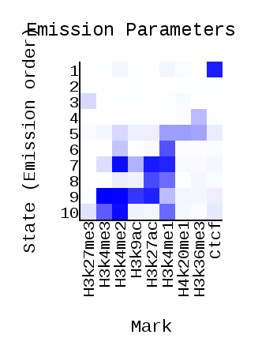
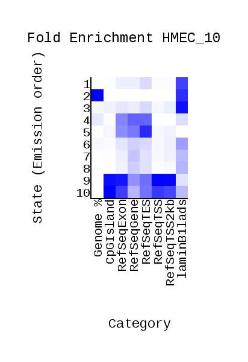
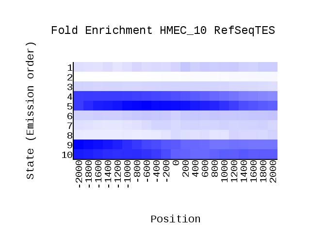
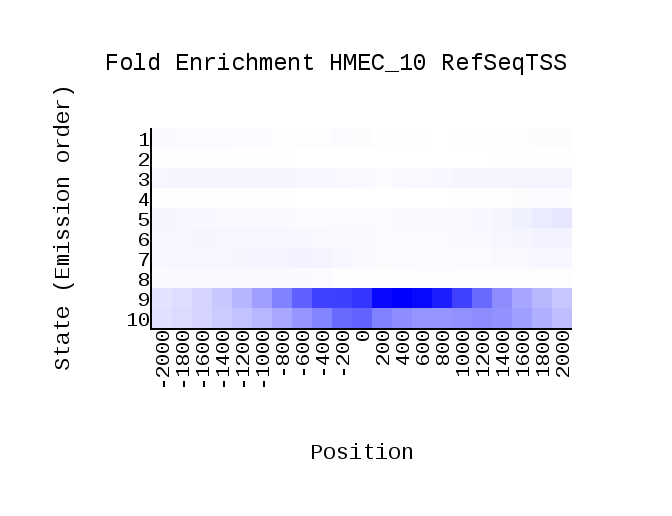
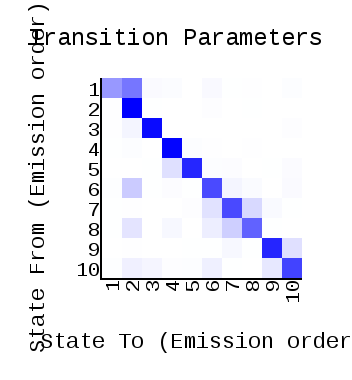
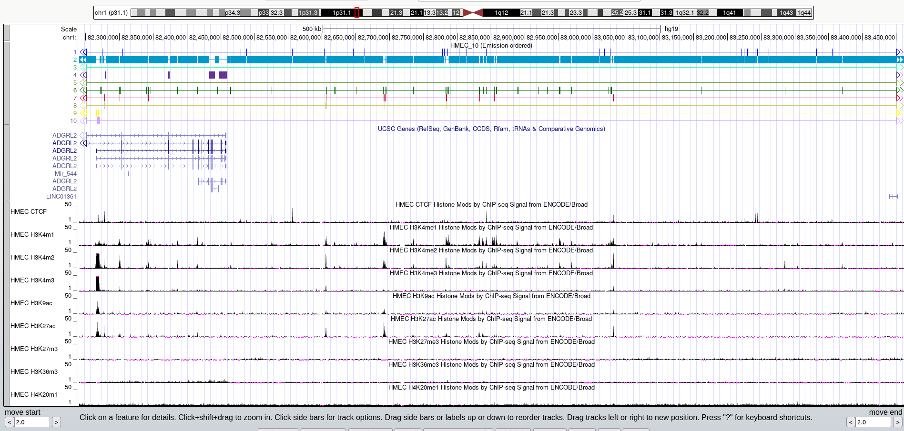
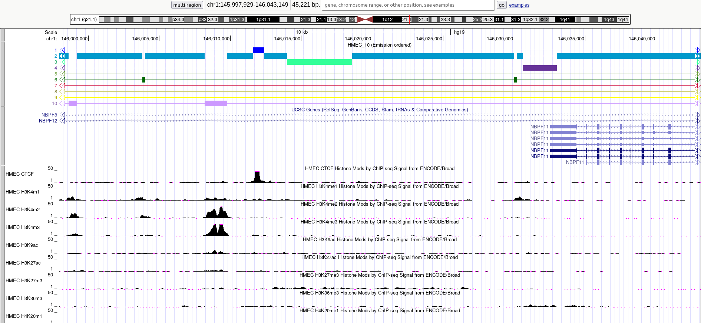
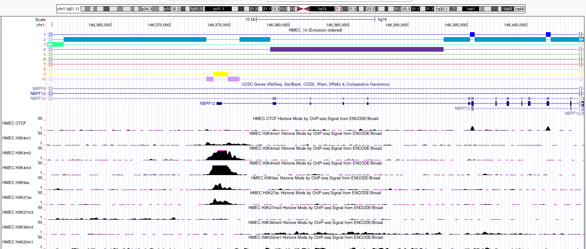
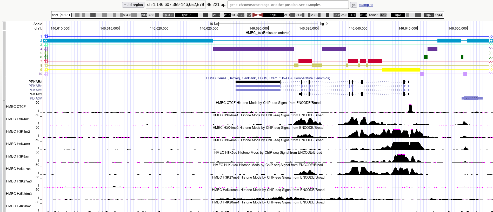

# hse\_hw3\_chromhmm

[Colab](https://colab.research.google.com/drive/1ymNLYNS-mQHe1xUDPKI-BjmMeYMMrGsk)

### Гистоновые метки

- [Связывание с CTCF](http://hgdownload.cse.ucsc.edu/goldenPath/hg19/encodeDCC/wgEncodeBroadHistone/wgEncodeBroadHistoneHmecCtcfStdAlnRep1.bam)
- [CTCF, 2-я реплика](http://hgdownload.cse.ucsc.edu/goldenPath/hg19/encodeDCC/wgEncodeBroadHistone/wgEncodeBroadHistoneHmecCtcfStdAlnRep2.bam) (не хватило меток, поэтому пришлось брать реплику)
- [H3k4me1](http://hgdownload.cse.ucsc.edu/goldenPath/hg19/encodeDCC/wgEncodeBroadHistone/wgEncodeBroadHistoneHmecH3k4me1StdAlnRep1.bam)
- [H3k4me2](http://hgdownload.cse.ucsc.edu/goldenPath/hg19/encodeDCC/wgEncodeBroadHistone/wgEncodeBroadHistoneHmecH3k4me2StdAlnRep1.bam)
- [H3k4me3](http://hgdownload.cse.ucsc.edu/goldenPath/hg19/encodeDCC/wgEncodeBroadHistone/wgEncodeBroadHistoneHmecH3k4me3StdAlnRep1.bam)
- [H3k9ac](http://hgdownload.cse.ucsc.edu/goldenPath/hg19/encodeDCC/wgEncodeBroadHistone/wgEncodeBroadHistoneHmecH3k9acStdAlnRep1.bam)
- [H3k27ac](http://hgdownload.cse.ucsc.edu/goldenPath/hg19/encodeDCC/wgEncodeBroadHistone/wgEncodeBroadHistoneHmecH3k27acStdAlnRep1.bam)
- [H3k27me3](http://hgdownload.cse.ucsc.edu/goldenPath/hg19/encodeDCC/wgEncodeBroadHistone/wgEncodeBroadHistoneHmecH3k27me3StdAlnRep1.bam)
- [H3k36me3](http://hgdownload.cse.ucsc.edu/goldenPath/hg19/encodeDCC/wgEncodeBroadHistone/wgEncodeBroadHistoneHmecH3k36me3StdAlnRep1.bam)
- [H4k20me1](http://hgdownload.cse.ucsc.edu/goldenPath/hg19/encodeDCC/wgEncodeBroadHistone/wgEncodeBroadHistoneHmecH4k20me1StdAlnRep1.bam)
- [Контроль](http://hgdownload.cse.ucsc.edu/goldenPath/hg19/encodeDCC/wgEncodeBroadHistone/wgEncodeBroadHistoneHmecControlStdAlnRep1.ba)

### Файлы

[cellmarkfiletable.txt](data/cellmarkfiletable.txt)

[Выдача ChromHMM](data/ChromHMM_output)

### Графики

### Скриншоты UCSC Genome Browser

Состояние 2 - гетерохроматин, нет выраженного сигнала.

Состояние 1 - инсулятор (CTCF), это заметно и по первому графику (Emission Parameters).

Состояния 9 и 10, скорее всего, соответствуют активному промотеру. В этих состояниях выражены сигналы H3k4me2, H3k4me3, в состоянии 9 также заметны сигналы H3k9ac, H3k27ac.

Состояние 4 может частично соответствовать [экзонам](https://epigenie.com/key-epigenetic-players/histone-proteins-and-modifications/histone-h3k36/). Характерная модификация - H3k36me3.

### Таблица

| Эпигенетический тип | Характерные метки                 | Свойства                          | Название         |
|---------------------|-----------------------------------|-----------------------------------|------------------|
| 1                   | CTCF                              |                                   | CTCF             |
| 2                   | Отсутствуют                       |                                   | Heterochromatin  |
| 3                   | H3k27me3                          |                                   | ???              |
| 4                   | H3k36me3                          | Часто пересекается с экзонами     | Exon             |
| 5                   | H3k4me1, H4k20me1, H3k36me3       |                                   | ???              |
| 6                   | H3k4me1                           |                                   | ???              |
| 7                   | H3k4me2, H3k27ac, H3k4me1         |                                   | ???              |
| 8                   | H3k27ac, H3k4me1                  |                                   | ???              |
| 9                   | H3k4me2, H3k4me3, H3k9ac, H3k27ac | Встречается близко к началу генов | Active\_promoter |
| 10                  | H3k4me1, H3k4me2, H3k4me3         | То же самое                       | Active\_promoter |

## Бонусное задание

[Код](code/rename.py)

[Файл с названиями треков](data/expanded.bed)
